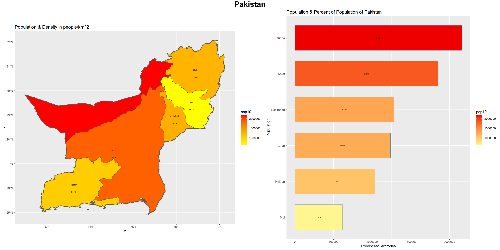

These are the plots that I created of Pakistan's population density. 
The main steps for making them compared to previous plots we've made in this class were using the geom_bar function,
as well as various tweeks that came along with that such as coord_flip() and stat='identity". I also learned how
to order the plot from greatest to least population with mutate and fct_reorder(). The next steps to improve these plots
would be to find a way to make all of the labels on the population density map visible. I would also want to change the 
format of the legend (both its title and the way the numbers are written) simply for aesthetic reasons.

