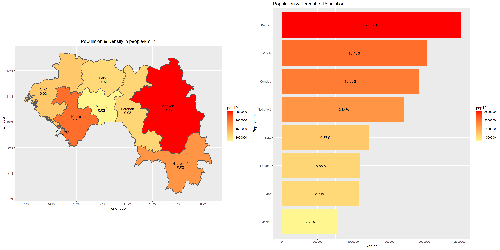
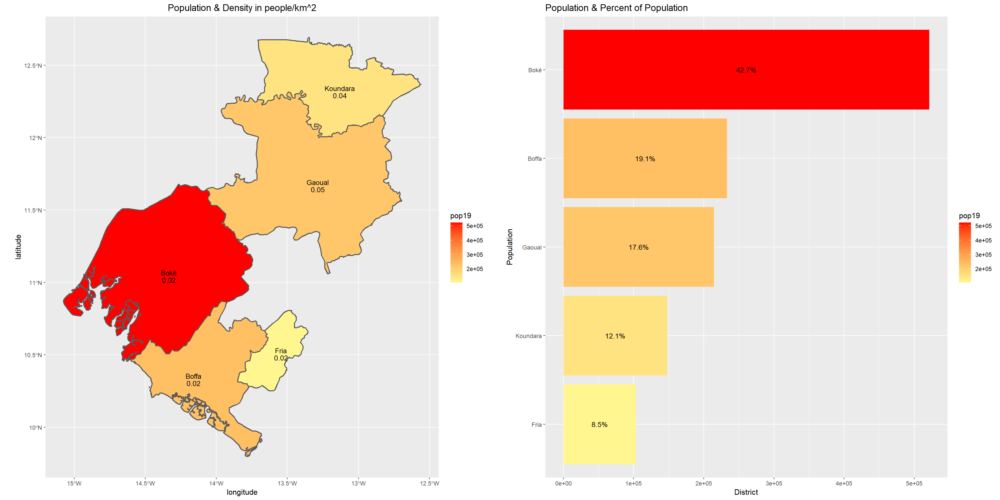
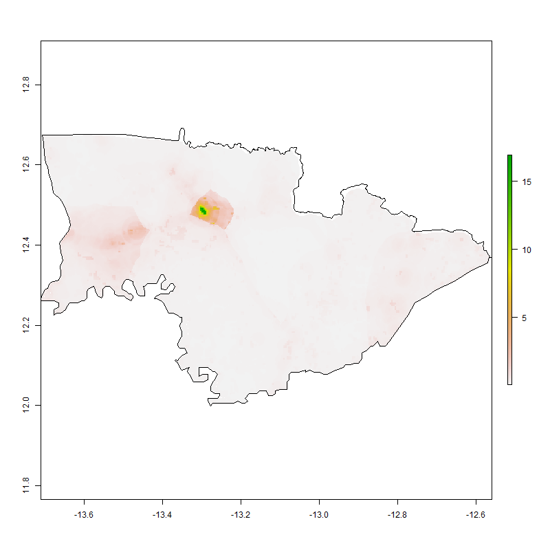

# Part 1

I decided to do my analysis on Guinea, primarily because it's population density is large enough to provide for interesting analysis, but still small enough for my computer to run. First I plotted a map showing the population of each region in Guinea. I then created a plot using the geom_bar function that presents the same information, on the population of each prefecture in Boke, except in bar plot version (and with some other differences like the percent of total population that's ncluded in the bar graph). 

Based off of these results, I decided to focus further on the Boke region, and repeated the same steps to create the same plots for the Boke region. Both of these plots were very helpful for me in terms of deciding which prefecture to use for the next stage of the project.

# Part 2
These plots shows the population of Koundara, the prefecture I decided to focus on in Boke. The first was done by plotting a population raster on top of a map shapefile. The second was done by creating a window object of the shapefile, using it to calculate the population density with rpoint, and then plotting them on top of one another. 
These plots really help you visualize where the population densities are. For instance you can clearly tell that there appears to be some sort of urban area in the upper left center of the prefecture, which is most likely its capital city (also named Koundara).

This graph was produced by plotting the contour lines over the density image. The polygons that represent the urban areas have been filtered to make sure outliers (like polygons with a population of 5 people) are removed. This ensures that the map is really representing the population clusters of Koundara, and not just noise in the data. 

The final map represents a variety of accessibility concerns for the Koundara prefecture. It shows the road network, with the primary roads in a darker brown. These are the only paved roads in the entire region, and there are only two of them. I was curious about the large network of roads in the lower left corner. I thought maybe there are so many roads there because it that's where Koundara connects
to the more populous Gaoual prefecture. However, Gaoual doesn't have any populated areas close to that part of the border. My guess is that it's just some data collection fluke, especially since their road types are all listed as "unclassified" (although many of the roads, including one of the paved ones, are). The hospitals in the region are also shown on the map. In this case, there is only one single hospital, which is interestingly not located in the capital, but a bit outside of it. 

# Zipf's Law
As you can see from this screenshot of my urban areas polygon's table, Koundara doesn't quite match Zipf's law. This could be due to the fact that the first two population sizes are just so large that they are outliers. However, looking through the rest of the urban areas, even disregarding the two largest, the data isn't really in line with Zipf's law

