  For this project I continued my focus on Guniea. I decided to look specifically at the Boke region, which is where the Koundara prefecture (which I analyzed for the last project) is located. I downloaded my survey data from DHS and selected columns for education, age, gender, location, size and weights to be in my data frame. There are a total of 7912 household observations in guniea (1073 of which are in Boke), and 10874 persons observations. 
1. rpoint plot of households

First I used the rpoint function to plot the households in Boke. The percent error was .2536. I sadly wasn't able to spatially locate my households on the adm0 level, because I kept running into an error that told me that R didn't have enough memory to complete the function. I tried many things to fix this problem, like allocating more memory space to R and doing the project on a cloud computing platform, but I wasn't able to get anything to work. This was disapointing, because I believe I would have gotten better results if I had been able to look at all of Guniea instead of just the 1073 household observations in Boke.
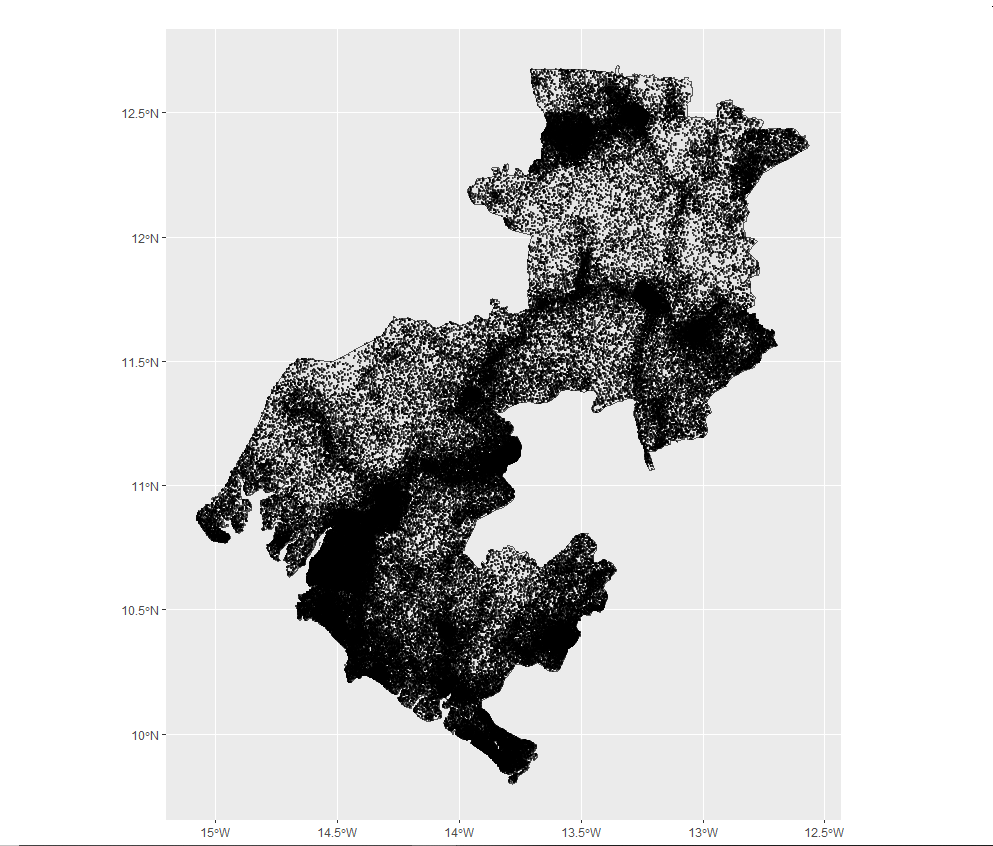

2. density/size plot

I created density plots that show the size of the households in Boke (which is represented by the green line) and Guinea (which is represented by the yellow curve). 
weighted error = 0.0004734058

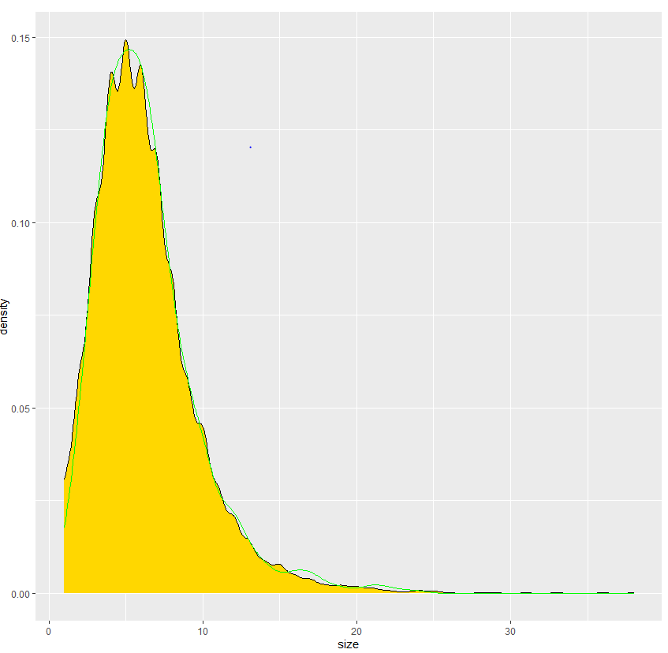

The first plot compares all of the households in Boke to all of the households in Guinea. The match is fairly good.

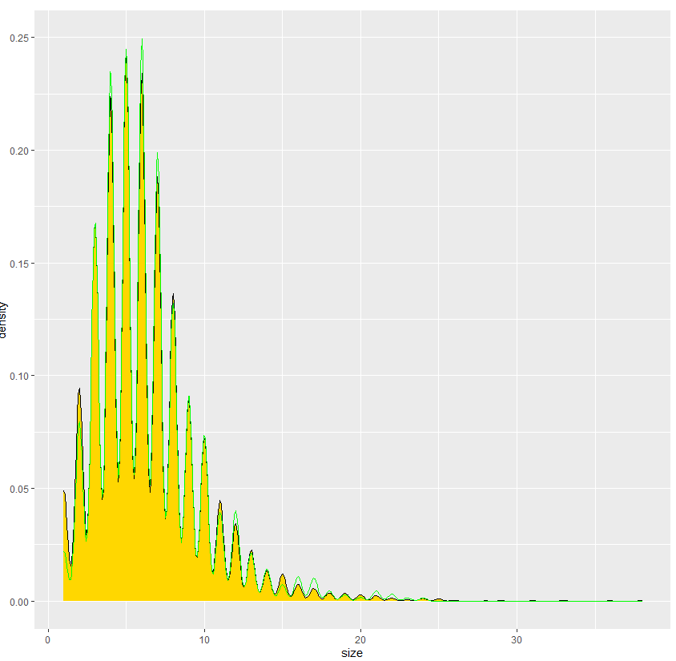

The second plot takes a random subsets of the households of Guinea and Boke equal to the number of households in Boke, and uses that as the comparison. The match is better here by a little bit.

3. heatplots

Next I made heatplots to demonstrate the predictive power of the data. I selected the age, gender, education and size columns to focus on. I made heatmaps with raw data, scaled data, normalized data, and percentized data. 

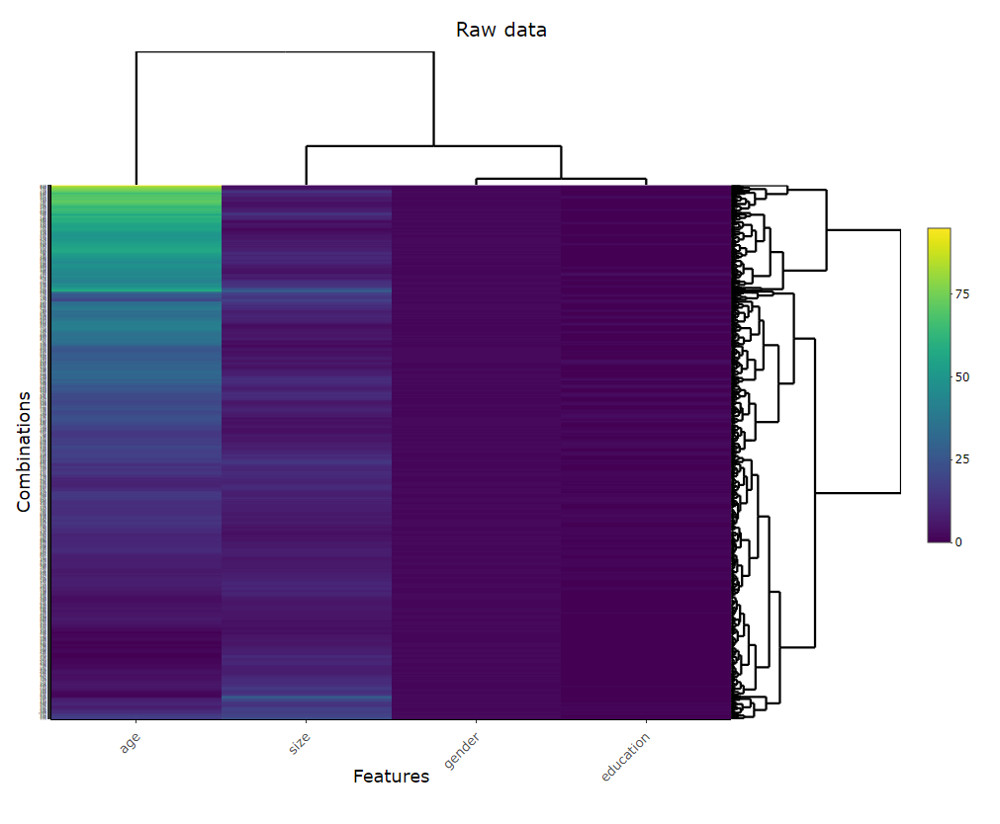

The raw data heatmap is mostly homogenous, the only variable that produces different combinations is age, which means that it could be a useful predictor. 

The scaled data heatmap is also fairly homogenous, but much less so than the raw data. This means that it has more predictive power.

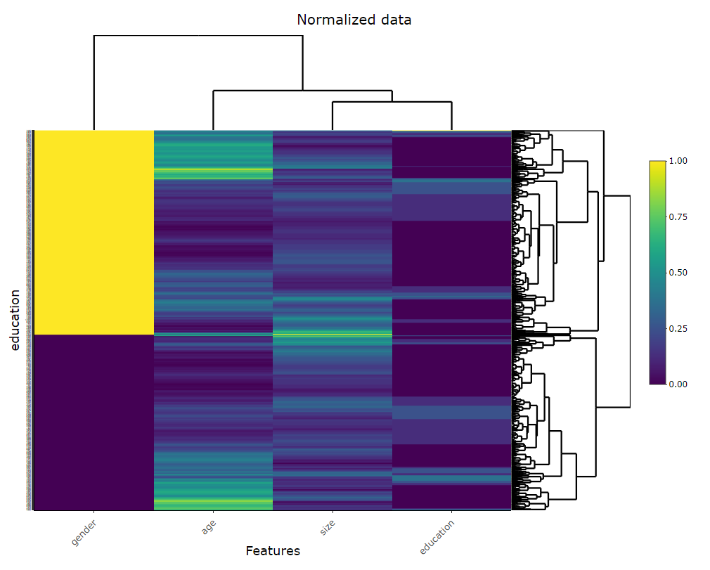

The normalized data is very interesting. There is some variability in size and a lot in age, but most notably there is a complete binary in gender. This is most likely because of the large gender gap in education in Guinea.

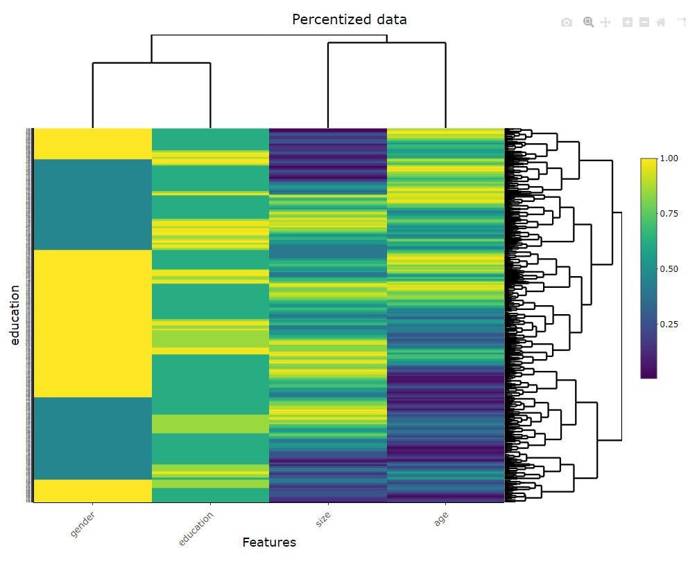

The percentized data has the most variability, and the most predictive power out of all of the data processing techniques.

4. ROC and GAIN graphs from models
Next I conducted a multinomial regression and ranger random forest to predict education. I then produced Gain and ROC charts for each regression.

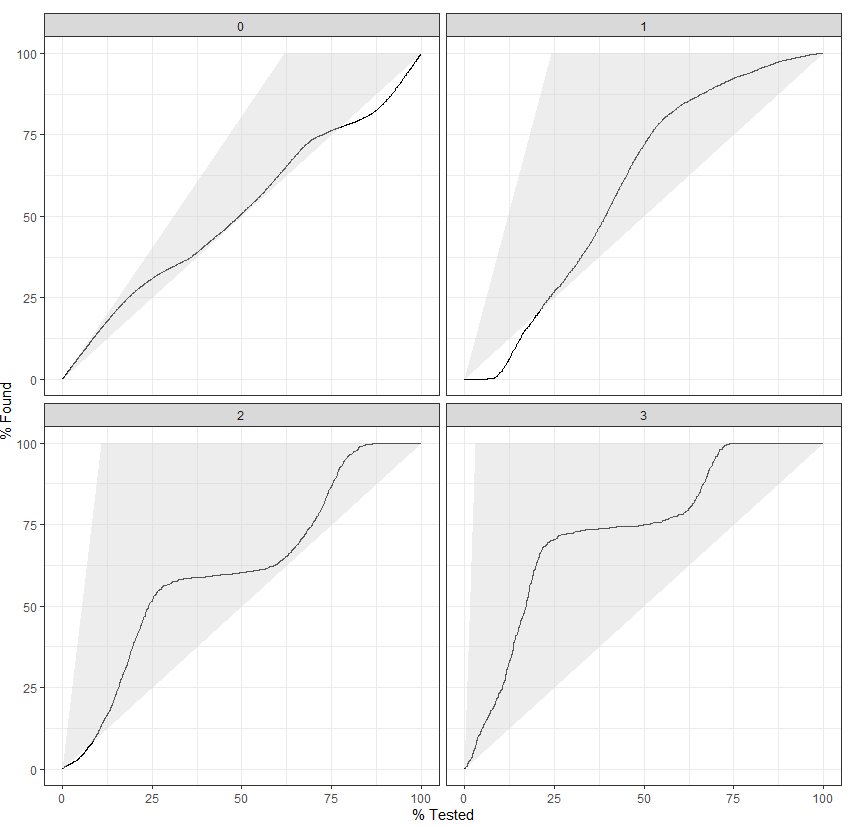
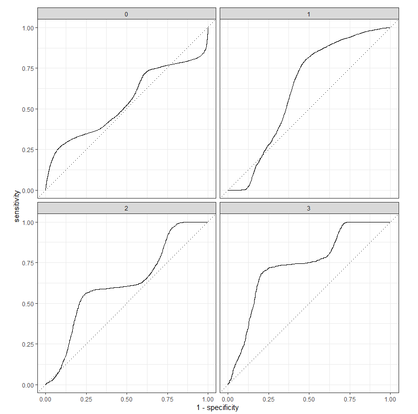

The above charts show the multinomial regression, which had an accuracy of .62. Both the Gain and ROC charts indicate that the model isn't a particularly strong predictor. 

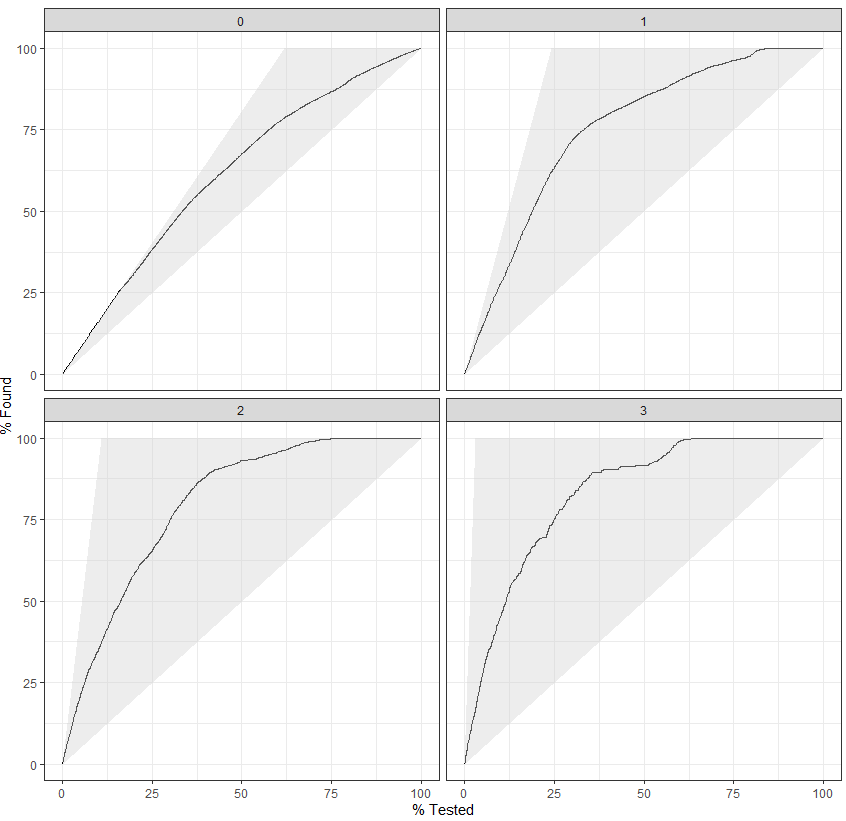
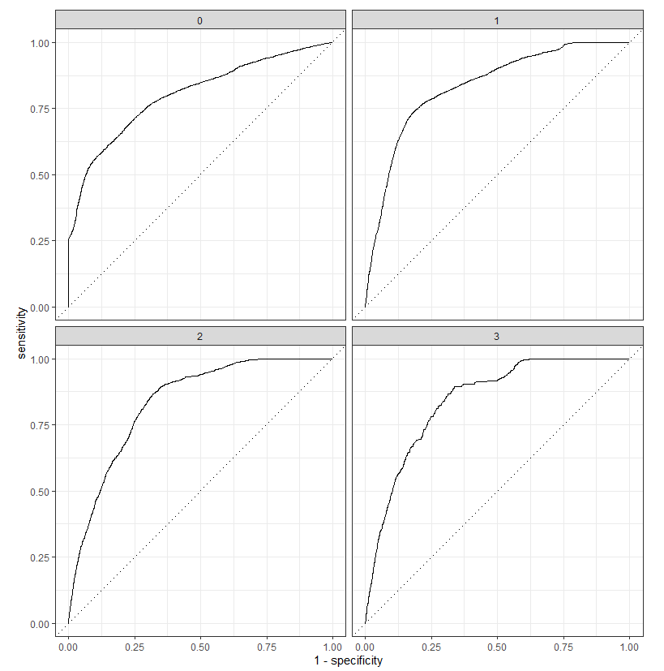

The above charts show the random forest model, which had an accuracy of .663. Although the accuracy score is not significantly higher than that of the multinomial regression, the ROC charts show a dramatic improvement, telling us that there is a higher true positive vs false positive rate for the random forest. 

5. prediction, truth confmat
Finally, I created a neural net with keras and tensorflow in order to predict education. It had an accuracy of .699 which is slightly higher than the random forest I created in the previous stage of my analysis. You can see the confusion matrix produced below, which tells you what level of education (0, 1, 2, or 3) the model has predicted for each person, and the actual true level of education they have attained.

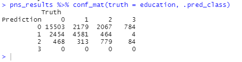

Lastly, I produced a graph that shows the correlations between age, household size, and predicted education level. Size is not a very strong predictor, but age seems to do a fairly good job.
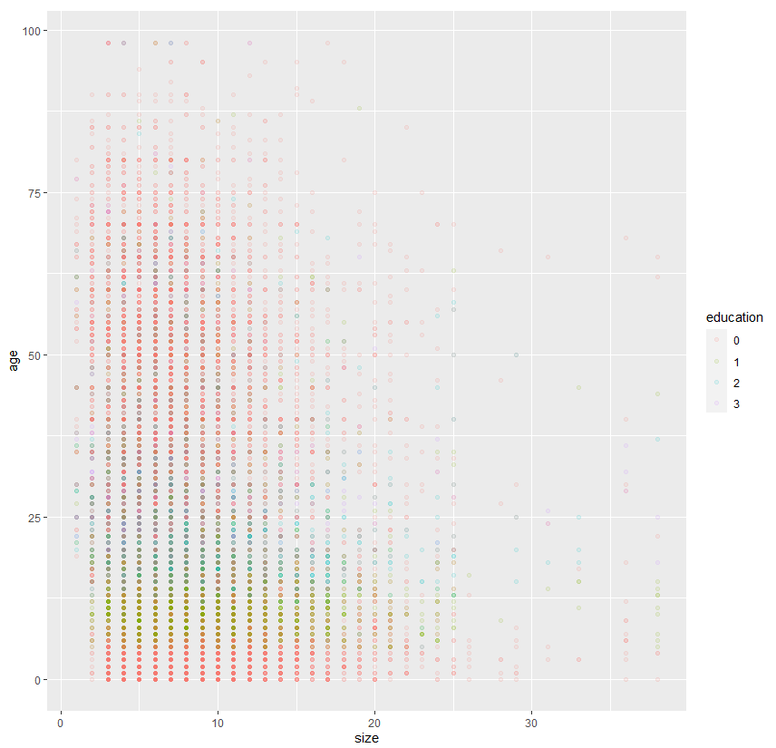
