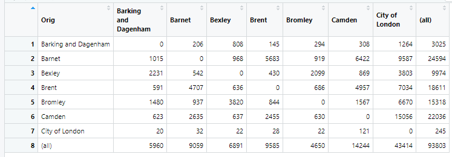
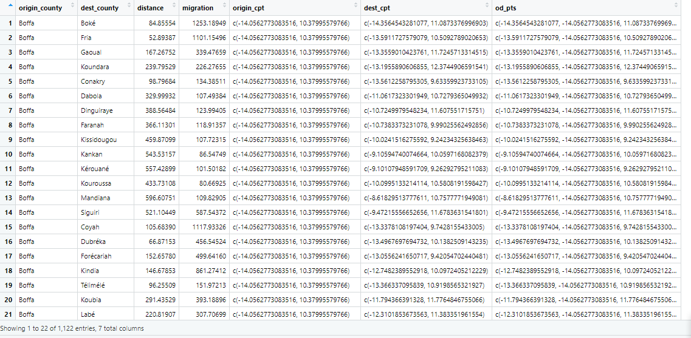
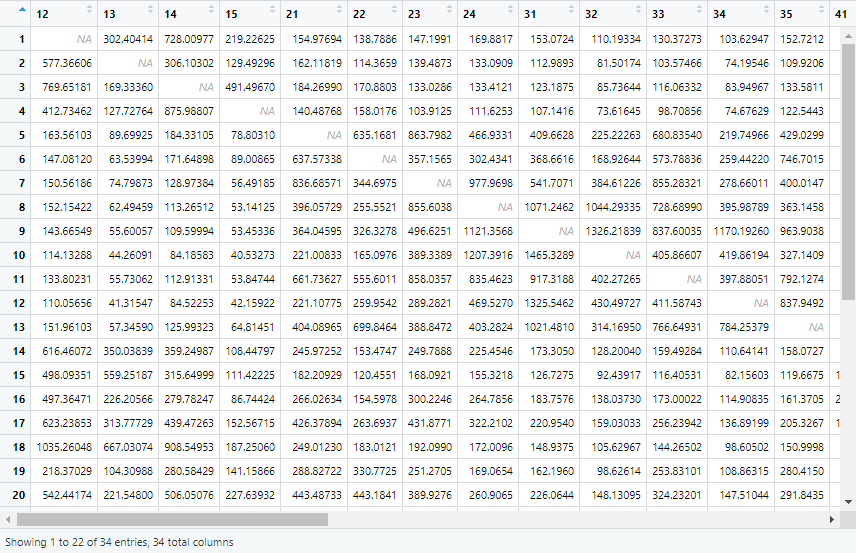
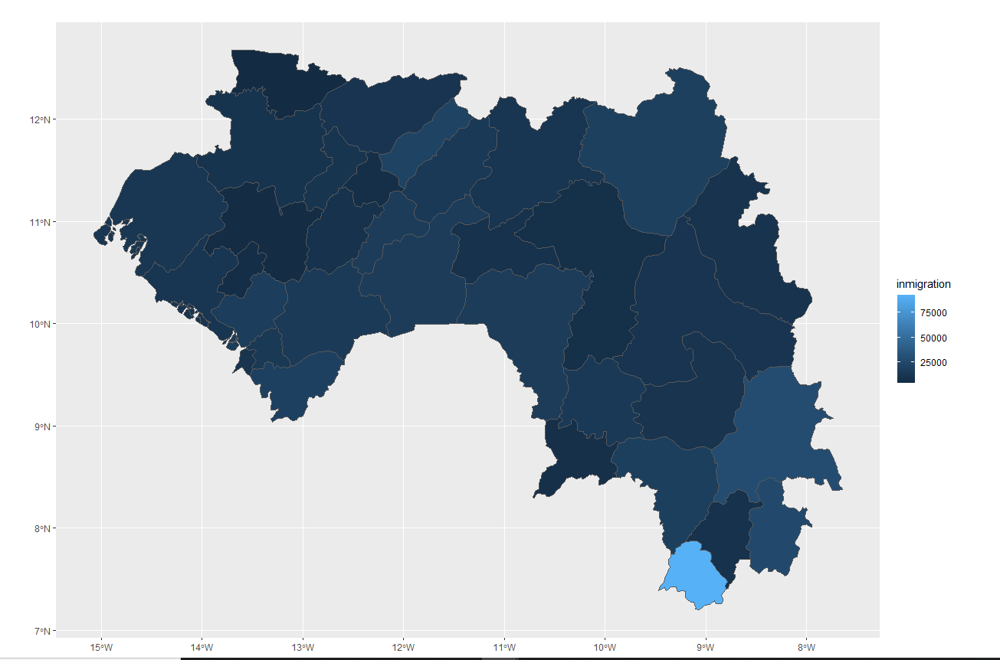
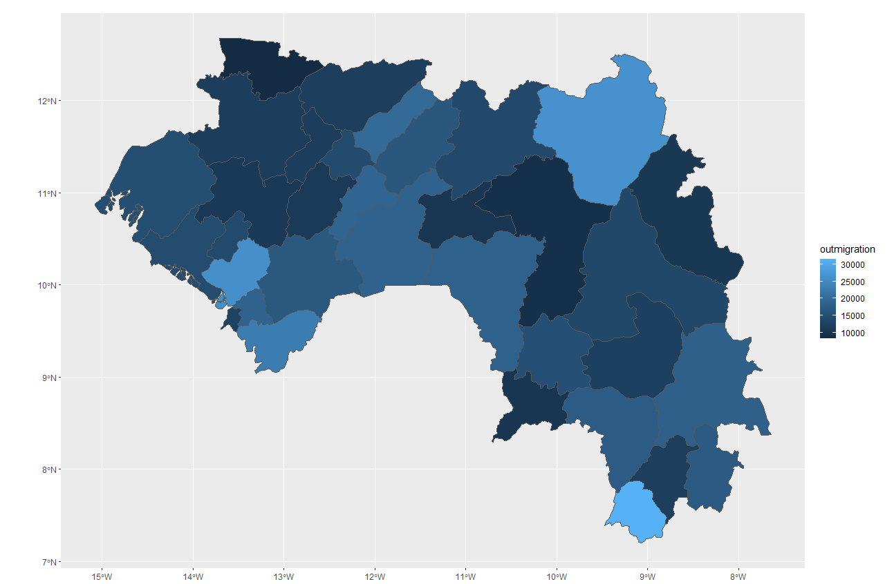
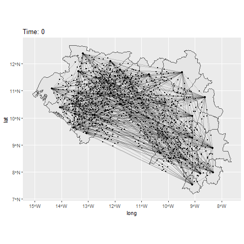
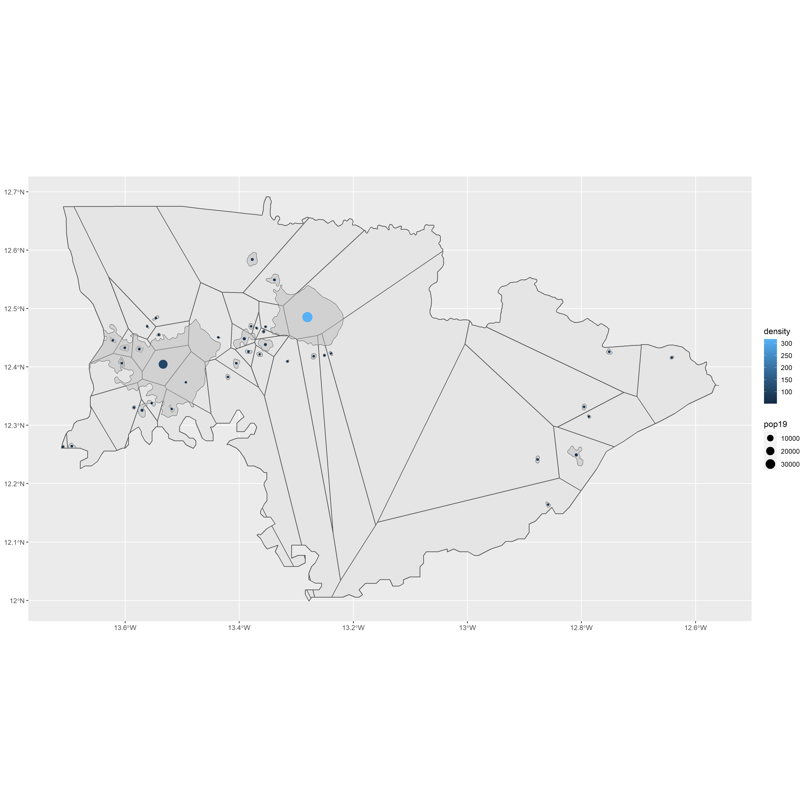

# FINAL PROJECT
## By Laura Opsahl-Ong

# London Gravity Model
For the first part of this project, I created a gravity model for London using code by Dr Adam Dennett. I created an origin-destination matrix similar to the one that I ended up creating for Guinea later in this project, except based off of the different boroughs of London. I was then able to create a gravity model, as well as some graphs to examine the model more closely. Reading "Modeling interal Migration Flows in Sub-Saharan Africa using Census Microdata" by Garcia et al. also helped to inform my knowledge on migration modeling. They explain how gravity models can be an extremely powerful tool, especially in the realm of international development. I have included a picture of my London origin-destination matrix below:

# Origin-Destination Matrix
For this project, I continued to examine at the Guinea, which is the country that I've been looking at for the duration of this class. I downloaded the 2010 migration flows for Guinea from World Pop, which are based on the ADM2 level. Using this data I created an origin destination matrix shown below:

My ODM has 34 rows, meaning that there are 34 districts withing Guinea that are measured for migration flow. Each number represents a ADM2 subdivision, so every box shows the flow of people from one subdivision to another. The empty boxes represent the flow within a single subdivision (so NA). 

# Migration Flows
I was able to use the migration flow data to make graphs showing where the majority of is coming from and going to. The first graph shows where people are migrating to, with the lighter blue areas having more migration to them. The second graph shows out migration, with lighter blue meaning that more people are leaving.

# Animation
Next, I made an animation to represent the flows between subdivisions. The animation is essentially a visualization of the origin destinitation matrix, with every point representing a ADM2 level district, the lines representing the flows between them, and the dots representing the people migrating along the flows. In the future, I would probably want to make a different kind of animation to represent migration flows in Guinea. Because there are 34 subdvisions, resulting in 1122 lines, the animation is very crowded and hard to get any information from. I think that a better way to do it would be to either select the largest flows and only represent those, or to group the ADM2 migration flows into ADM1 flows so that there are fewer lines. 

# Voronoi Polygons
Lastly, I created centroids based off the defacto settlements that I had made back in project one. Then, using those centroids, I made  voronoi polygons around them. The graph below shows the voronoi polygons, the estimated population centers, with their density being represented by their shade of blue, and their population size being represented by the size of the circle, as well as the defacto settlement boundaries. I was only able to create voronoi polygons in Koundara because I could only calculate the bandwidth object for Koundara, and if I tried to calculate it for a larger area I would get a vector size error. 

In the future, I would like the be able to include more variables in my analysis. I think that it would be interesting to use the road network shapefile from project 2 to estimate distance to a road, and see if that impacts the model. I would have also liked to have been able to incorporate the nighttime lights dataset. I attempted to include it, but for whatever reason by computer had trouble with extracting the raster. I think that could have been helpful because nighttime lights can be extremely helpful population and develpment indicators.
