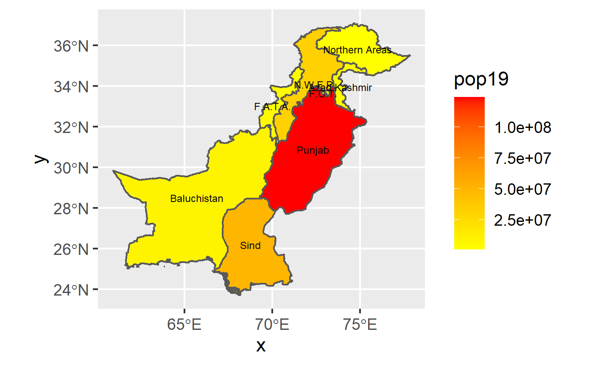
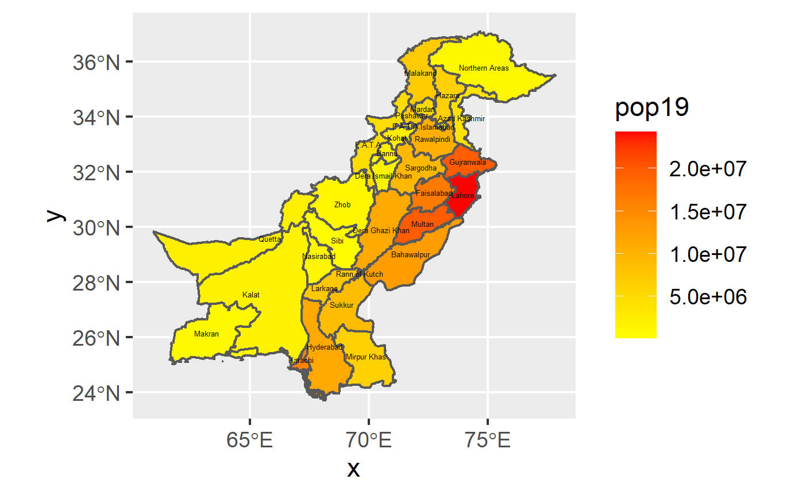
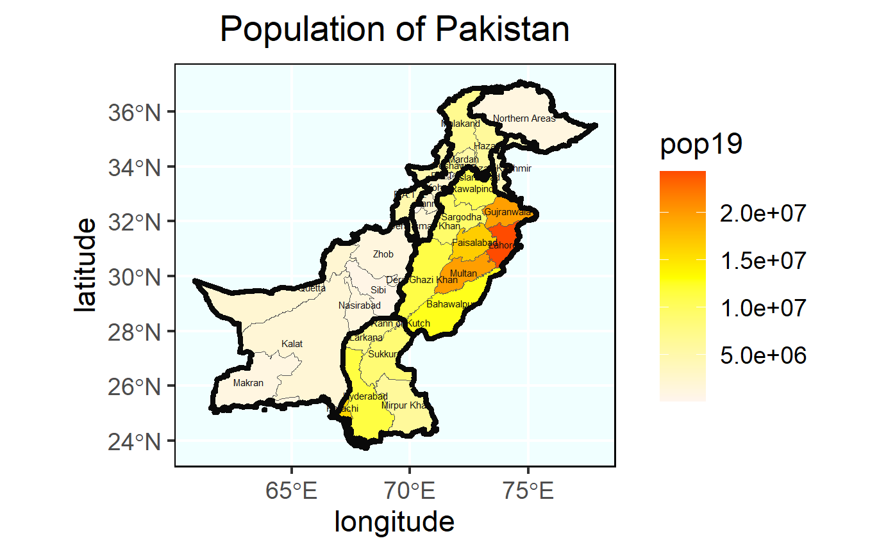

# WEEK 2 ASSIGNMENT 
## Extracting Populations from a Raster and Aggregating to each Unit

This is the map I made of Pakistan's population gradiant at the ADM1 level.

The next map that I made was a population gradiant map of Pakistan, but this time at the ADM2 level.

Finally, I made a map of the population gradiant showing both the ADM1 and ADM2 boundaries. 
This map is much more detailed, and includes things such as a background and title.

